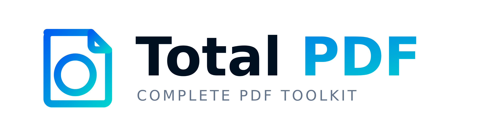

<p align="center">
  
</p>

<h1 align="center">Total PDF - The Open-Source PDF Platform</h1>

Total PDF is a powerful, open-source PDF editing platform. Run it as a personal desktop app, in the browser, or deploy it on your own servers with a private API. Edit, sign, redact, convert, and automate PDFs without sending documents to external services.

<p align="center">
  <a href="https://github.com/adamwang99/total-pdf">
    
  </a>
  <a href="https://discord.gg/HYmhKj45pU">
    
  </a>
  <a href="https://github.com/adamwang99/total-pdf">
    
  </a>
  <a href="https://github.com/adamwang99/total-pdf">
    
  </a>
</p>



## Key Capabilities

- **Everywhere you work** - Desktop client, browser UI, and self-hosted server with a private API.
- **50+ PDF tools** - Edit, merge, split, sign, redact, convert, OCR, compress, and more.
- **Automation & workflows** - No-code pipelines direct in UI with APIs to process millions of PDFs.
- **Enterprise‑grade** - SSO, auditing, and flexible on‑prem deployments.
- **Developer platform** - REST APIs available for nearly all tools to integrate into your existing systems.
- **Global UI** - Interface available in 40+ languages.

For a full feature list, see the docs: **https://docs.totalpdf.com**

## Quick Start

```bash
docker run -p 8080:8080 https://github.com/adamwang99/total-pdf
```

Then open: http://localhost:8080

For full installation options (including desktop and Kubernetes), see our [Documentation Guide](https://docs.totalpdf.com/#documentation-guide).

## Resources

- [**Documentation**](https://docs.totalpdf.com)
- [**Homepage**](https://totalpdf.com)
- [**API Docs**](https://registry.scalar.com/@aiworld/apis/total-pdf-processing-api/)
- [**Server Plan & Enterprise**](https://docs.totalpdf.com/Paid-Offerings)

## Support

- **Community** [Discord](https://discord.gg/HYmhKj45pU)
- **Bug Reports**: [Github issues](https://github.com/adamwang99/total-pdf/issues)

## Contributing

We welcome contributions! Please see [CONTRIBUTING.md](CONTRIBUTING.md) for guidelines.

This project uses [Task](https://taskfile.dev/) as a unified command runner for all build, dev, and test commands. Run `task install` to get started, or see the [Developer Guide](DeveloperGuide.md) for full details.

For adding translations, see the [Translation Guide](devGuide/HowToAddNewLanguage.md).

## License

Total PDF is open-core. See [LICENSE](LICENSE) for details.
